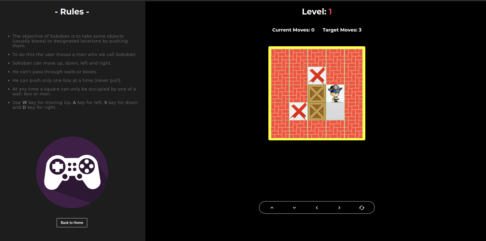

# Sokoban Angular

This project was generated with [Angular CLI](https://github.com/angular/angular-cli) version 6.2.8.

Sokoban is a classical puzzle game in which the player pushes crates or boxes around in a warehouse, trying to get them to storage locations.

For trial purposes: https://sokoban-35bb0.web.app/

## Development server

1. Run `npm i` to install dependencies.
2. Run `ng serve` for a dev server.
3. Navigate to `http://localhost:4200/`.
4. The app will automatically reload if you change any of the source files.

## Example

### HomePage

### Level 1

### Level 5

## Contributors

1. [Deepak Tiwari](https://github.com/deepaktiwari88/)
2. [Arunav Sharma](https://github.com/arunav11/)
3. [Madhav Pruthi](https://github.com/MadhavPruthi/)
